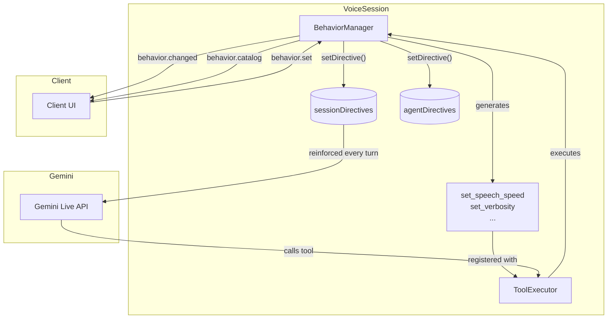
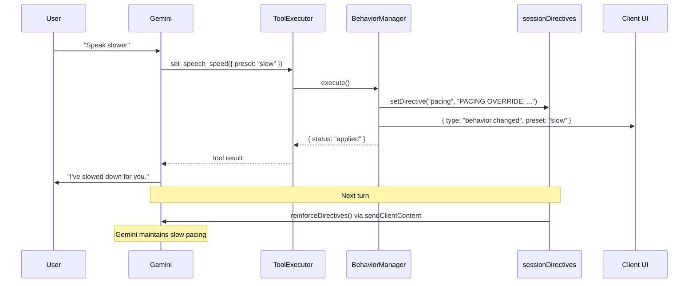
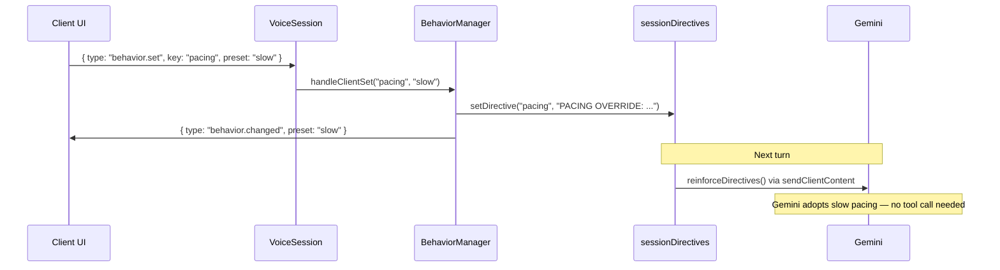
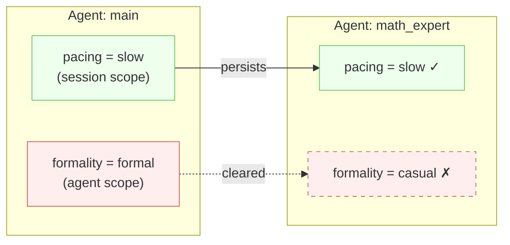

# Behaviors

Behaviors let you make voice agent characteristics — speech speed, verbosity, response language — adjustable at runtime. Instead of hand-coding a tool for each behavior, you declare presets and the framework auto-generates the tools, manages state, and syncs with the client UI.

## Quick Start

```typescript
import { speechSpeed } from '@bodhi_agent/realtime-agent-framework';

const session = new VoiceSession({
  // ...required config...
  behaviors: [speechSpeed()],
});
```

That's it. The user can now say "speak slower" and the framework:
1. Generates a `set_speech_speed` tool with `slow` / `normal` / `fast` presets
2. When Gemini calls it, sets a pacing directive that's reinforced every turn
3. Notifies the client UI so it can update a speed indicator

## Architecture

BehaviorManager sits between the ToolExecutor and the directive system. It auto-generates tools that Gemini can call, and manages state that flows to both the Gemini context (via directives) and the client UI (via WebSocket JSON).



Changes can come from two directions — the user's voice (via Gemini tool call) or the client UI (via WebSocket message). Both paths converge on the same BehaviorManager state.

## Data Flow: Voice Command

When the user says "speak slower", the change flows through Gemini's tool calling:



## Data Flow: Client UI Button

When the user taps a speed button in the UI, the change bypasses Gemini entirely:



## How It Works

A **BehaviorCategory** declares a tunable behavior with named presets. Each preset maps to a directive string that gets injected into the model's context:

```typescript
import type { BehaviorCategory } from '@bodhi_agent/realtime-agent-framework';

const formality: BehaviorCategory = {
  key: 'formality',
  toolName: 'set_formality',
  toolDescription: 'Change the formality of responses.',
  presets: [
    { name: 'casual', label: 'Casual', directive: null },  // default — no directive
    {
      name: 'formal',
      label: 'Formal',
      directive: 'Use formal, professional language. Avoid contractions and slang.',
    },
  ],
  scope: 'session',
};
```

The framework creates one inline tool per category. When the LLM calls `set_formality({ preset: 'formal' })`, the directive is set and reinforced every turn via `sendClientContent`, preventing behavioral drift.

## Configuration

| Property | Type | Required | Description |
|----------|------|----------|-------------|
| `key` | `string` | Yes | Unique category key — becomes the directive key |
| `toolName` | `string` | Yes | Auto-generated tool name for the LLM |
| `toolDescription` | `string` | Yes | Tells the model when to use this tool |
| `presets` | `BehaviorPreset[]` | Yes | Ordered presets — first is the default |
| `scope` | `'session' \| 'agent'` | No | `session` (default) persists across agent transfers |

Each **BehaviorPreset**:

| Property | Type | Description |
|----------|------|-------------|
| `name` | `string` | Machine-readable name (becomes enum value in tool schema) |
| `label` | `string` | Human-readable label for client UI display |
| `directive` | `string \| null` | Directive text injected into model context. `null` = no directive |

::: tip
The first preset in the list is the default. Convention: make it `directive: null` (e.g., "normal") so no directive is injected until the user explicitly requests a change.
:::

## Built-in Presets

The framework ships with factory functions for common behaviors:

### `speechSpeed()`

Controls speech pacing with slow / normal / fast presets:

```typescript
import { speechSpeed } from '@bodhi_agent/realtime-agent-framework';

const session = new VoiceSession({
  behaviors: [speechSpeed()],
  // ...
});
```

Presets: `normal` (default, no directive), `slow` (short sentences, frequent pauses), `fast` (dense compound sentences).

### `verbosity()`

Controls response detail level:

```typescript
import { verbosity } from '@bodhi_agent/realtime-agent-framework';

const session = new VoiceSession({
  behaviors: [speechSpeed(), verbosity()],
  // ...
});
```

Presets: `normal` (default), `brief` (one sentence max), `detailed` (thorough explanations).

### `responseLanguage()`

Switches the response language. You provide the language list:

```typescript
import { responseLanguage } from '@bodhi_agent/realtime-agent-framework';

const session = new VoiceSession({
  behaviors: [
    responseLanguage([
      { name: 'en', label: 'English', directive: 'Respond in English.' },
      { name: 'es', label: 'Spanish', directive: 'Respond entirely in Spanish.' },
      { name: 'zh', label: 'Chinese', directive: 'Respond entirely in Mandarin Chinese.' },
    ]),
  ],
  // ...
});
```

All built-in factories accept an optional `toolDescription` override:

```typescript
speechSpeed({ toolDescription: 'Adjust how quickly Bodhi speaks.' })
```

## Client Protocol

The framework communicates with the client UI via three JSON messages over WebSocket:

### `behavior.catalog` (Server → Client)

Sent when a client connects. Contains all categories and their active presets:

```json
{
  "type": "behavior.catalog",
  "categories": [
    {
      "key": "pacing",
      "toolName": "set_speech_speed",
      "presets": [
        { "name": "normal", "label": "Normal" },
        { "name": "slow", "label": "Slow" },
        { "name": "fast", "label": "Fast" }
      ],
      "active": "normal"
    }
  ]
}
```

### `behavior.changed` (Server → Client)

Sent after any preset change (from the LLM or client):

```json
{ "type": "behavior.changed", "key": "pacing", "preset": "slow" }
```

### `behavior.set` (Client → Server)

Sent by the client UI when a user taps a button. Bypasses the LLM — the directive takes effect on the next turn:

```json
{ "type": "behavior.set", "key": "pacing", "preset": "slow" }
```

## Scope

Each behavior declares a **scope** that controls what happens on agent transfer:

- **`session`** (default): The directive persists across agent transfers via `sessionDirectives`. Use for user preferences like pacing or language.
- **`agent`**: The directive is cleared when the user transfers to a new agent via `agentDirectives`. Use for agent-specific behaviors.



```typescript
const formality: BehaviorCategory = {
  key: 'formality',
  toolName: 'set_formality',
  toolDescription: 'Change formality level.',
  presets: [
    { name: 'casual', label: 'Casual', directive: null },
    { name: 'formal', label: 'Formal', directive: 'Use formal language.' },
  ],
  scope: 'agent',  // Resets when user transfers to another agent
};
```

## Complete Example

A voice assistant with speech speed and verbosity controls:

```typescript
import { google } from '@ai-sdk/google';
import {
  VoiceSession,
  speechSpeed,
  verbosity,
} from '@bodhi_agent/realtime-agent-framework';
import type { MainAgent } from '@bodhi_agent/realtime-agent-framework';

const agent: MainAgent = {
  name: 'assistant',
  instructions: 'You are a helpful voice assistant.',
  tools: [/* your app tools — no behavior tools needed here */],
};

const session = new VoiceSession({
  sessionId: `session_${Date.now()}`,
  userId: 'user_1',
  apiKey: process.env.GEMINI_API_KEY!,
  agents: [agent],
  initialAgent: 'assistant',
  port: 9900,
  model: google('gemini-2.5-flash'),
  behaviors: [speechSpeed(), verbosity()],
});

await session.start();
// User can now say "speak slower" or "be more detailed"
```

The behavior tools are automatically appended to every agent's tool list — you don't need to add them to individual agents.
